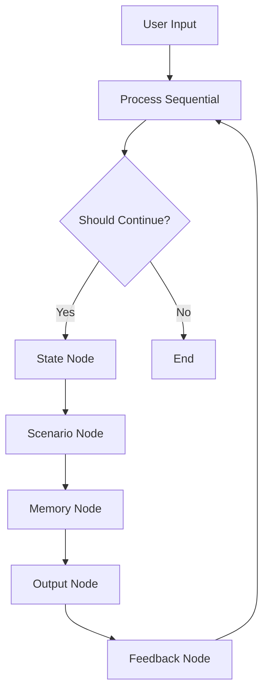

# 페르소나 에이전트 시스템 기술 문서

## 1. 시스템 개요

### 1.1 목적
페르소나 에이전트 시스템은 사용자와 자연스러운 대화를 나누며 감정적 교류가 가능한 AI 에이전트를 구현하는 것을 목표로 합니다. 특히 러닝크루 페이서라는 특정 페르소나를 가진 에이전트가 사용자와 상호작용하면서 관계를 발전시키고 시나리오를 진행하는 구조로 설계되었습니다.

이 시스템의 핵심 목표는 다음과 같습니다:
1. **자연스러운 감정 교류**: 8가지 기본 감정을 기반으로 한 복합적인 감정 표현
2. **관계 발전**: 상호작용 품질에 기반한 점진적인 친밀도 상승
3. **맥락 기반 대화**: 이전 대화 내용과 현재 상황을 고려한 응답 생성
4. **시나리오 기반 진행**: 단계별로 발전하는 대화 구조를 통한 자연스러운 관계 형성

### 1.2 주요 특징
#### 1.2.1 감정 상태 관리
- **기본 감정**: joy, trust, fear, surprise, sadness, disgust, anger, anticipation
- **감정 조합**: 기본 감정들의 복합적 조합을 통한 풍부한 감정 표현
- **동적 변화**: 대화 맥락에 따른 자연스러운 감정 상태 전이
- **임계값 시스템**: 미세한 변화 필터링을 통한 안정적인 감정 상태 유지

#### 1.2.2 친밀도 시스템
- **점수 범위**: 0-100점 스케일
- **변화 요인**: 
  - 기본 상호작용 품질
  - 시나리오별 보너스
  - 감정 상태 영향
  - 대화 지속성

#### 1.2.3 시나리오 구조
- **3단계 시나리오**:
  1. Warmup Pack: 초기 만남과 준비 운동
  2. Running Greeting: 러닝 중 대화
  3. Afterparty: 운동 후 심화 대화
- **진행 조건**: 
  - 친밀도 임계값
  - 필수 감정 상태
  - 이전 단계 완료

#### 1.2.4 맥락 인식 시스템
- **단기 메모리**: 최근 5개 대화 기록
- **장기 메모리**: 주요 사건과 정보 저장
- **맥락 정보**: 
  - 현재 시나리오 상태
  - 감정 변화 이력
  - 중요 대화 포인트

#### 1.2.5 음성 출력 시스템
- **ElevenLabs API 활용**
- **음성 특성**: 
  - 안정성: 0.75
  - 유사도: 0.75
- **출력 형식**: MP3 (44100Hz, 128kbps)

## 2. 시스템 아키텍처

### 2.1 핵심 컴포넌트
#### 2.1.1 State Node
- **감정 상태 관리**
  - 8가지 기본 감정 각각의 강도 관리 (-1.0 ~ 1.0)
  - 감정 변화량 제한 (-0.3 ~ +0.3)
  - 감정 임계값 처리 (0.1)
- **친밀도 점수 계산**
  - 기본 변화량 (-5.0 ~ +15.0)
  - 시나리오 보너스 적용
  - 최종 점수 정규화 (0 ~ 100)
- **상호작용 품질 평가**
  - 대화 적절성 평가
  - 감정적 교감 수준 측정
  - 맥락 이해도 평가
- **상태 업데이트 검증**
  - 변화량 유효성 검사
  - 상태 일관성 확인
  - 로깅 및 모니터링

#### 2.1.2 Scenario Node
- **시나리오 진행 관리**
  - 현재 시나리오 상태 추적
  - 전환 조건 모니터링
  - 실패 상황 처리
- **목표 달성도 평가**
  - 시나리오별 목표 추적
  - 진행률 계산
  - 성공/실패 판정
- **다음 시나리오 선택**
  - 조건 기반 시나리오 필터링
  - 최적 시나리오 선정
  - 전환 과정 관리
- **실패 조건 처리**
  - 최대 실패 횟수 관리
  - 재시작 로직
  - 사용자 피드백 제공

#### 2.1.3 Memory Node
- **단기 메모리 관리**
  - 최근 대화 기록 유지
  - 임시 컨텍스트 관리
  - 우선순위 기반 메모리 정리
- **장기 메모리 저장**
  - 중요 정보 선별
  - 시나리오별 메모리 구조화
  - 검색 가능한 형태로 저장
- **대화 이력 유지**
  - 시간순 대화 기록
  - 중요 포인트 마킹
  - 컨텍스트 연결
- **맥락 정보 처리**
  - 현재 상황 분석
  - 관련 정보 검색
  - 응답 생성을 위한 컨텍스트 구성

#### 2.1.4 Output Node
- **응답 생성**
  - 맥락 기반 응답 생성
  - 페르소나 특성 반영
  - 감정 상태 표현
- **음성 합성**
  - ElevenLabs API 연동
  - 음성 파라미터 조정
  - 오디오 스트림 관리
- **메타데이터 관리**
  - 응답 관련 정보 기록
  - 상태 변화 추적
  - 시스템 모니터링 데이터
- **사용자 피드백 처리**
  - 피드백 수집
  - 응답 품질 평가
  - 개선점 도출

#### 2.1.5 Feedback Node
- **상호작용 품질 평가**
  - 대화 자연스러움 평가
  - 목표 달성도 측정
  - 사용자 만족도 추정
- **사용자 반응 분석**
  - 감정 상태 변화 분석
  - 관심도 측정
  - 참여도 평가
- **개선 제안 생성**
  - 문제점 식별
  - 개선 방향 제시
  - 구체적 액션 아이템 도출

### 2.2 워크플로우 구조
시스템의 워크플로우는 다음과 같은 순환 구조로 설계되었습니다:



#### 2.2.1 워크플로우 단계별 설명
1. **사용자 입력 처리**
   - 텍스트 정규화
   - 의도 분석
   - 초기 컨텍스트 구성

2. **프로세스 시퀀스**
   - 노드 순차 실행
   - 상태 관리
   - 에러 처리

3. **계속 여부 판단**
   - 종료 조건 확인
   - 상태 유효성 검사
   - 시스템 리소스 체크

4. **노드 체인 실행**
   - 상태 업데이트
   - 시나리오 관리
   - 메모리 처리
   - 출력 생성
   - 피드백 분석

### 2.3 데이터 흐름

#### 2.3.1 상태 관리 흐름
```
User Input -> State Analysis -> Emotion Update -> Affinity Calculation -> State Update
```
- **입력 처리**: 사용자 메시지 파싱 및 정규화
- **상태 분석**: 현재 시스템 상태 평가
- **감정 업데이트**: 감정 상태 변화 계산
- **친밀도 계산**: 상호작용 품질 기반 점수 조정
- **상태 갱신**: 최종 상태 업데이트 및 검증

#### 2.3.2 시나리오 진행 흐름
```
Current State -> Goal Evaluation -> Requirement Check -> Scenario Transition -> Context Update
```
- **현재 상태 확인**: 시나리오 진행 상황 파악
- **목표 평가**: 달성도 및 남은 목표 확인
- **요구사항 검증**: 전환 조건 충족 여부 확인
- **시나리오 전환**: 다음 단계로의 자연스러운 전환
- **컨텍스트 갱신**: 새로운 시나리오에 맞는 컨텍스트 설정

#### 2.3.3 메모리 관리 흐름
```
Interaction -> Short-term Memory -> Context Analysis -> Long-term Memory -> Memory Consolidation
```
- **상호작용 기록**: 대화 내용 및 메타데이터 저장
- **단기 메모리 관리**: 최근 컨텍스트 유지
- **컨텍스트 분석**: 중요 정보 식별
- **장기 메모리 저장**: 핵심 정보 영구 저장
- **메모리 통합**: 전체 메모리 구조 최적화

## 3. 주요 기능 상세

### 3.1 감정 시스템
#### 3.1.1 감정 변화 메커니즘
- **변화 범위**: -0.3 ~ +0.3 (단일 상호작용)
  - 급격한 변화 방지
  - 자연스러운 감정 전이
  - 안정성 유지
- **임계값 시스템**: 
  - 최소 변화량: 0.1
  - 노이즈 필터링
  - 안정적 상태 유지
- **정규화 프로세스**:
  - 입력값 범위 조정
  - 경계값 처리
  - 스케일링 로직

#### 3.1.2 감정 조합 규칙
- **기본 감정 간 상호작용**
  - 상충 감정 처리
  - 보완 감정 강화
  - 전이 규칙
- **복합 감정 생성**
  - 가중치 기반 조합
  - 상황별 우선순위
  - 페르소나 특성 반영

### 3.2 친밀도 시스템
#### 3.2.1 기본 변화 메커니즘
- **변화 범위**: -5.0 ~ +15.0
  - 기본 상호작용 영향
  - 누적 효과
  - 감소 제한

#### 3.2.2 시나리오별 보너스 시스템
- **Warmup Pack**
  - 조건: interaction_quality > 0.5
  - 보너스: +10.0
  - 초기 관계 형성 촉진
- **Running Greeting**
  - 조건: interaction_quality > 0.6
  - 보너스: +10.0
  - 관계 발전 가속
- **Afterparty**
  - 조건: interaction_quality > 0.7
  - 보너스: +15.0
  - 관계 심화 보상

#### 3.2.3 상호작용 품질 평가
- **평가 기준**
  - 대화 적절성
  - 감정적 교감
  - 목표 달성도
- **품질 점수 계산**
  - 가중치 적용
  - 컨텍스트 고려
  - 페르소나 특성 반영

### 3.3 시나리오 관리
#### 3.3.1 진행 조건
- **친밀도 요구사항**
  - 단계별 최소 점수
  - 진행 속도 조절
  - 자연스러운 발전
- **감정 상태 조건**
  - 필수 감정 수준
  - 감정 균형
  - 상황 적합성
- **선행 조건**
  - 이전 시나리오 완료
  - 목표 달성 확인
  - 전환 준비도

#### 3.3.2 실패 처리 시스템
- **실패 카운터**
  - 최대 5회 제한
  - 누적 효과
  - 리셋 조건
- **재시작 메커니즘**
  - 자동 제안
  - 상태 초기화
  - 진행 경로 조정
- **피드백 시스템**
  - 실패 원인 분석
  - 개선 제안
  - 사용자 가이드

## 4. 구현 세부사항

### 4.1 상태 업데이트 로직
#### 4.1.1 감정 업데이트 프로세스
```python
# 감정 업데이트
def update_emotion(current: float, change: float) -> float:
    """
    감정 상태 업데이트 함수
    
    Args:
        current (float): 현재 감정 값 (-1.0 ~ 1.0)
        change (float): 변화량 (-0.3 ~ 0.3)
        
    Returns:
        float: 업데이트된 감정 값
    """
    # 변화량 제한
    emotion_change = max(min(change, 0.3), -0.3)
    
    # 임계값 처리
    if abs(emotion_change) < 0.1:
        return current
        
    # 최종값 계산 및 정규화
    final_value = max(min(current + emotion_change, 1.0), 0.0)
    
    return final_value
```

#### 4.1.2 친밀도 업데이트 프로세스
```python
# 친밀도 업데이트
def update_affinity(current: float, base_change: float, interaction_quality: float, scenario: str) -> float:
    """
    친밀도 점수 업데이트 함수
    
    Args:
        current (float): 현재 친밀도 (0 ~ 100)
        base_change (float): 기본 변화량
        interaction_quality (float): 상호작용 품질 (0 ~ 1)
        scenario (str): 현재 시나리오
        
    Returns:
        float: 업데이트된 친밀도 점수
    """
    # 기본 변화량 제한
    affinity_change = max(min(base_change, 15.0), -5.0)
    
    # 시나리오 보너스 적용
    bonus = 0.0
    if scenario == "warmup_pack" and interaction_quality > 0.5:
        bonus = 10.0
    elif scenario == "running_greeting" and interaction_quality > 0.6:
        bonus = 10.0
    elif scenario == "afterparty" and interaction_quality > 0.7:
        bonus = 15.0
        
    # 최종값 계산 및 정규화
    final_affinity = max(min(current + affinity_change + bonus, 100.0), 0.0)
    
    return final_affinity
```

### 4.2 시나리오 전환 조건
#### 4.2.1 전환 조건 검증
```python
def should_transition(state: State, scenario: Scenario) -> bool:
    """
    시나리오 전환 조건 검증 함수
    
    Args:
        state (State): 현재 상태
        scenario (Scenario): 현재 시나리오
        
    Returns:
        bool: 전환 가능 여부
    """
    # 친밀도 조건 확인
    if scenario.min_affinity and state.affinity_score < scenario.min_affinity:
        return False
        
    # 감정 상태 조건 확인
    for emotion, required_value in scenario.required_emotions.items():
        if state.emotions[emotion] < required_value:
            return False
            
    # 선행 시나리오 완료 확인
    for required_scenario in scenario.required_scenarios:
        if required_scenario not in state.completed_scenarios:
            return False
            
    return True
```

#### 4.2.2 전환 프로세스
```python
async def transition_scenario(state: State, available_scenarios: List[Scenario]) -> Optional[Scenario]:
    """
    시나리오 전환 실행 함수
    
    Args:
        state (State): 현재 상태
        available_scenarios (List[Scenario]): 사용 가능한 시나리오 목록
        
    Returns:
        Optional[Scenario]: 선택된 다음 시나리오
    """
    # 조건을 만족하는 시나리오 필터링
    valid_scenarios = [
        s for s in available_scenarios
        if should_transition(state, s)
    ]
    
    if not valid_scenarios:
        return None
        
    # 최적의 시나리오 선택
    next_scenario = await select_best_scenario(state, valid_scenarios)
    
    # 전환 전 정리 작업
    await cleanup_current_scenario(state)
    
    # 새 시나리오 초기화
    await initialize_new_scenario(state, next_scenario)
    
    return next_scenario
```

### 4.3 메모리 관리
#### 4.3.1 메모리 시스템 구조
```python
class MemorySystem:
    """메모리 관리 시스템"""
    
    def __init__(self):
        self.short_term: List[Interaction] = []  # 최근 5개 상호작용
        self.long_term: Dict[str, Memory] = {}   # 시나리오별 주요 기억
        self.context: Dict[str, Any] = {}        # 현재 맥락 정보
        
    async def update_short_term(self, interaction: Interaction):
        """단기 메모리 업데이트"""
        self.short_term.append(interaction)
        if len(self.short_term) > 5:
            # 오래된 메모리 이동 여부 결정
            oldest = self.short_term.pop(0)
            await self._evaluate_for_long_term(oldest)
            
    async def _evaluate_for_long_term(self, interaction: Interaction):
        """장기 메모리 저장 여부 평가"""
        importance = await self._calculate_importance(interaction)
        if importance > 0.7:  # 중요도 임계값
            scenario_id = interaction.scenario_id
            if scenario_id not in self.long_term:
                self.long_term[scenario_id] = Memory()
            self.long_term[scenario_id].add_memory(interaction)
            
    def get_context(self) -> Dict[str, Any]:
        """현재 컨텍스트 조회"""
        return {
            "short_term": self.short_term[-3:],  # 최근 3개 상호작용
            "relevant_memories": self._get_relevant_memories(),
            "current_context": self.context
        }
```

#### 4.3.2 메모리 최적화
```python
class Memory:
    """장기 메모리 관리"""
    
    def __init__(self):
        self.memories: List[MemoryItem] = []
        self.index: Dict[str, List[int]] = {}  # 키워드 기반 인덱스
        
    def add_memory(self, interaction: Interaction):
        """메모리 추가 및 인덱싱"""
        memory_item = MemoryItem(interaction)
        self.memories.append(memory_item)
        
        # 키워드 추출 및 인덱싱
        keywords = self._extract_keywords(interaction)
        for keyword in keywords:
            if keyword not in self.index:
                self.index[keyword] = []
            self.index[keyword].append(len(self.memories) - 1)
            
    def optimize(self):
        """메모리 최적화"""
        # 중복 제거
        unique_memories = self._remove_duplicates()
        
        # 중요도 기반 정리
        important_memories = self._filter_by_importance(unique_memories)
        
        # 인덱스 재구성
        self._rebuild_index(important_memories)
```

## 5. 확장 및 개선 방향

### 5.1 현재 한계점
#### 5.1.1 감정 모델의 한계
- **선형적 변화**
  - 단순한 증감 모델
  - 복잡한 감정 표현의 한계
  - 상황 맥락 반영 부족
- **고정된 임계값**
  - 상황별 유연성 부족
  - 개인화 한계
  - 학습 기반 조정 불가

#### 5.1.2 시나리오 시스템의 한계
- **고정된 구조**
  - 미리 정의된 시나리오만 가능
  - 분기 제한
  - 사용자 맞춤 부족
- **전환의 경직성**
  - 엄격한 조건
  - 유연성 부족
  - 자연스러운 흐름 방해

#### 5.1.3 맥락 처리의 한계
- **제한된 메모리**
  - 단기 기억 제한
  - 선택적 장기 저장
  - 복잡한 맥락 유실
- **단순한 검색**
  - 키워드 기반 검색
  - 의미적 연관성 부족
  - 맥락 이해 한계

### 5.2 개선 제안
#### 5.2.1 비선형 감정 모델
- **다차원 감정 공간**
  - 복합 감정 표현
  - 상황별 가중치
  - 동적 임계값
- **학습 기반 조정**
  - 사용자별 패턴 학습
  - 상황 인식 개선
  - 적응형 변화

#### 5.2.2 동적 시나리오 생성
- **템플릿 기반 생성**
  - 기본 구조 활용
  - 동적 내용 생성
  - 사용자 맞춤
- **분기 다양화**
  - 조건부 전개
  - 다중 경로
  - 유연한 전환

#### 5.2.3 고급 맥락 처리
- **의미 기반 검색**
  - 임베딩 활용
  - 연관성 분석
  - 맥락 이해 강화
- **장기 기억 최적화**
  - 중요도 기반 저장
  - 연관 정보 통합
  - 효율적 검색

#### 5.2.4 멀티모달 지원
- **다양한 입력 처리**
  - 음성 인식
  - 표정 분석
  - 제스처 인식
- **풍부한 출력**
  - 감정 표현 강화
  - 시각적 피드백
  - 다중 채널 활용

## 6. 결론
페르소나 에이전트 시스템은 감정적 교류와 관계 발전을 중심으로 설계된 대화형 AI 시스템입니다. 각 컴포넌트가 유기적으로 연결되어 자연스러운 대화 흐름을 만들어내며, 향후 더 풍부한 상호작용을 위한 확장이 가능한 구조를 가지고 있습니다.

### 6.1 주요 성과
- 8가지 기본 감정을 활용한 풍부한 감정 표현
- 시나리오 기반의 자연스러운 관계 발전
- 효율적인 메모리 관리 시스템
- 확장 가능한 모듈식 구조

### 6.2 향후 발전 방향
- 더 복잡한 감정 모델 도입
- 동적 시나리오 생성 시스템 개발
- 고급 맥락 처리 능력 강화
- 멀티모달 상호작용 지원 확대 